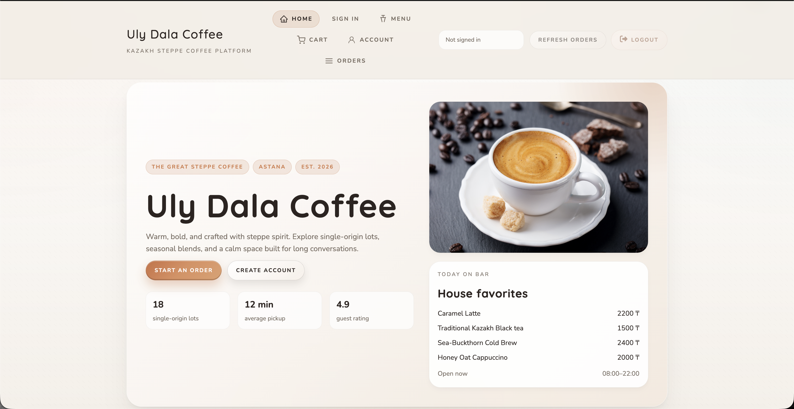
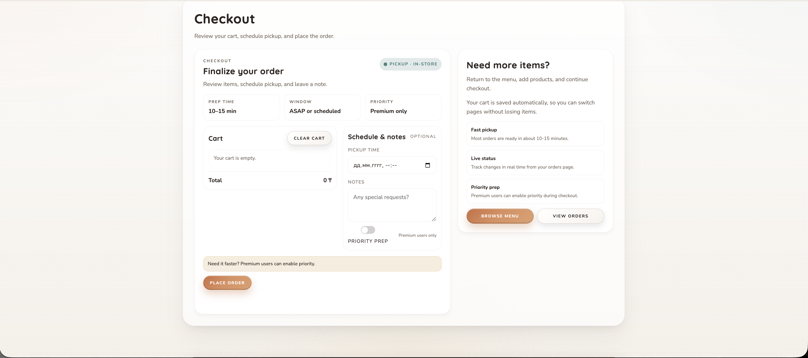
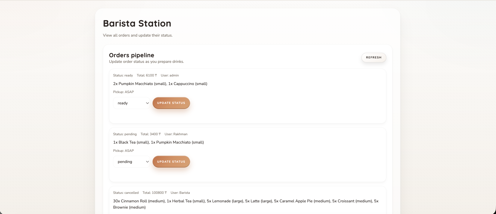
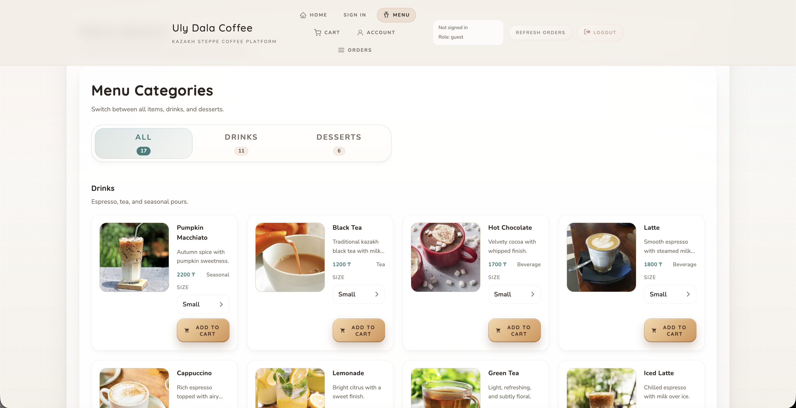

# Uly Dala Coffee

https://coffee-shop.commedeschamps.dev

Uly Dala Coffee is a full-stack coffee ordering platform built with Node.js, Express, MongoDB Atlas, and a responsive web UI. Users can register, log in, browse products, place orders, and track order status. Staff roles (`admin`, `barista`) manage operations, while `premium` users can submit priority orders.

## Project Overview

This project includes:
- JWT-based authentication with bcrypt password hashing
- Role-based access control (RBAC)
- MongoDB Atlas persistence with Mongoose models
- Order lifecycle management (create, view, update, delete)
- Product catalog management for admin users
- SMTP email integration (welcome email, password reset, order status updates)
- Responsive frontend pages served by Express

## Tech Stack

- Node.js
- Express
- MongoDB Atlas + Mongoose
- Joi (request validation)
- JWT (`jsonwebtoken`)
- bcrypt
- Nodemailer (SMTP)
- HTML/CSS/Vanilla JavaScript frontend

## Repository Structure

```text
config/
  db.js
controllers/
  authController.js
  orderController.js
  productController.js
  userController.js
middleware/
  auth.js
  errorHandler.js
  roles.js
  validate.js
models/
  Order.js
  Product.js
  User.js
public/
  *.html
  app.js
  css/
  js/
routes/
  authRoutes.js
  orderRoutes.js
  productRoutes.js
  userRoutes.js
services/
  emailService.js
validators/
  authValidators.js
  orderValidators.js
  productValidators.js
  userValidators.js
server.js
```

## Setup Instructions

### 1) Install dependencies

```bash
npm install
```

### 2) Configure environment variables

```bash
cp .env.example .env
```

Set values in `.env`:
- `PORT` - app port (default `4000`)
- `MONGODB_URI` - MongoDB Atlas URI (not localhost)
- `JWT_SECRET` - JWT signing secret
- `JWT_EXPIRES_IN` - token expiry (example: `7d`)
- `APP_URL` - public app URL used in emails (production: `https://coffee-shop.commedeschamps.dev`)
- `PASSWORD_RESET_EXPIRES_MINUTES` - reset token lifetime
- `SMTP_HOST`, `SMTP_PORT`, `SMTP_SECURE`, `SMTP_USER`, `SMTP_PASS`, `SMTP_FROM` - SMTP config

### 3) Run the app

Development:

```bash
npm run dev
```

Production:

```bash
npm start
```

Local App/UI URL: `http://localhost:4000`
Local API health check: `http://localhost:4000/api/health`
Deployed App URL: `https://coffee-shop.commedeschamps.dev`
Deployed API health check: `https://coffee-shop.commedeschamps.dev/api/health`

### 4) Optional seed scripts

```bash
npm run seed
npm run seed:images
```

## Authentication

Protected routes require:

`Authorization: Bearer <JWT_TOKEN>`

## API Documentation

Note: Most routes are available under `/api/...` and compatibility aliases without `/api` are mounted too.

### Public Auth Endpoints

- `POST /api/auth/register`
  - Body:

```json
{
  "username": "coffee_lover",
  "email": "coffee@example.com",
  "password": "Pass1234",
  "role": "user"
}
```

- `POST /api/auth/login`
  - Body:

```json
{
  "email": "coffee@example.com",
  "password": "Pass1234"
}
```

- `POST /api/auth/forgot-password`
  - Body:

```json
{
  "email": "coffee@example.com"
}
```

- `POST /api/auth/reset-password/:token`
  - Body:

```json
{
  "password": "Pass1234",
  "passwordConfirm": "Pass1234"
}
```

### Private User Endpoints

- `GET /api/users/profile`
- `PUT /api/users/profile`
  - Body (at least one field):

```json
{
  "username": "new_name",
  "email": "new@email.com"
}
```

### Private Order Endpoints

- `POST /api/orders`
  - Body example:

```json
{
  "items": [
    { "product": "64f0b2d26a7f4b6a9f001234", "size": "medium", "quantity": 1 }
  ],
  "notes": "Extra hot",
  "pickupTime": "2026-02-01T10:30:00.000Z",
  "priority": false
}
```

- `GET /api/orders` - own orders (or all for barista)
- `GET /api/orders/all` - all orders (`admin`, `barista`)
- `GET /api/orders/:id`
- `PUT /api/orders/:id`
- `DELETE /api/orders/:id`

### Product Endpoints

- `GET /api/products` - public
- `GET /api/products/:id` - public
- `POST /api/products` - admin only
- `PUT /api/products/:id` - admin only
- `DELETE /api/products/:id` - admin only

## Role-Based Access Control (RBAC)

Roles in system:
- `user`
- `premium`
- `barista`
- `admin`

Access summary:
- `user`: create/view own orders, cancel own pending orders
- `premium`: `user` permissions + can set `priority` on orders
- `barista`: view all orders and update order `status` only
- `admin`: full order and product management

## Validation and Error Handling

- Joi validators in `validators/*`
- Request validation middleware: `middleware/validate.js`
- Global error handler: `middleware/errorHandler.js`
- Typical status codes used:
  - `400` validation or bad request
  - `401` unauthorized/invalid token
  - `403` forbidden
  - `404` not found
  - `500` internal server error

## Frontend Pages

Main pages:
- `/` - Home
- `/auth.html` - Register/Login/Forgot/Reset Password
- `/products.html` - Product catalog
- `/checkout.html` - Cart and order creation
- `/dashboard.html` - Orders
- `/account.html` - Profile management
- `/admin.html` - Admin panel
- `/barista.html` - Barista station

## Email Integration (SMTP)

Implemented in `services/emailService.js`:
- Welcome email after registration
- Password reset email
- Order status update email

## Deployment

You can deploy on Render, Railway, or Replit.

Basic steps:
1. Push this repo to GitHub.
2. Create a web service.
3. Set environment variables from `.env.example`.
4. Deploy and verify `/api/health`.

## Screenshots

### Home Page
Landing page with hero section and navigation.



### Checkout
Cart and order placement flow.



### Barista Station
Staff-facing order queue and status updates.



### Additional UI View
Additional app interface screenshot.

